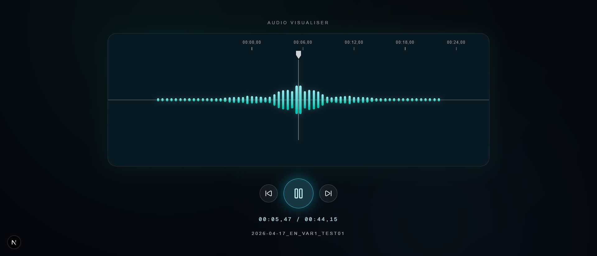

# Audio Visualiser App

Interactive audio visualizer built with **Next.js 16 + React 19**.



## Features

- Import multiple local audio files
- Play / pause, previous / next track
- Mirrored animated frequency bars
- Timeline centered on current playback position
- Toggle bottom-half bar visibility

## Stack

- Next.js `16.2.4`
- React `19.2.4`
- TypeScript
- Tailwind CSS v4
- Framer Motion
- Lucide React

## Quick Start

### Requirements

- Node.js `>=20`
- npm

### Install

```bash
npm install
```

### Run (dev)

```bash
npm run dev
```

App runs at `http://localhost:3000`.

## Scripts

```bash
npm run dev    # start development server
npm run build  # production build
npm run start  # run production build
npm run lint   # lint project
```

## Structure

```text
app/page.tsx                   # UI entry point
components/AudioVisualizer.tsx # visualizer logic + UI
public/screencapture.png       # project preview
```

## Notes

- Audio files are played locally via `URL.createObjectURL`.
- No backend API is required.
- License: MIT ([LICENSE](./LICENSE))
